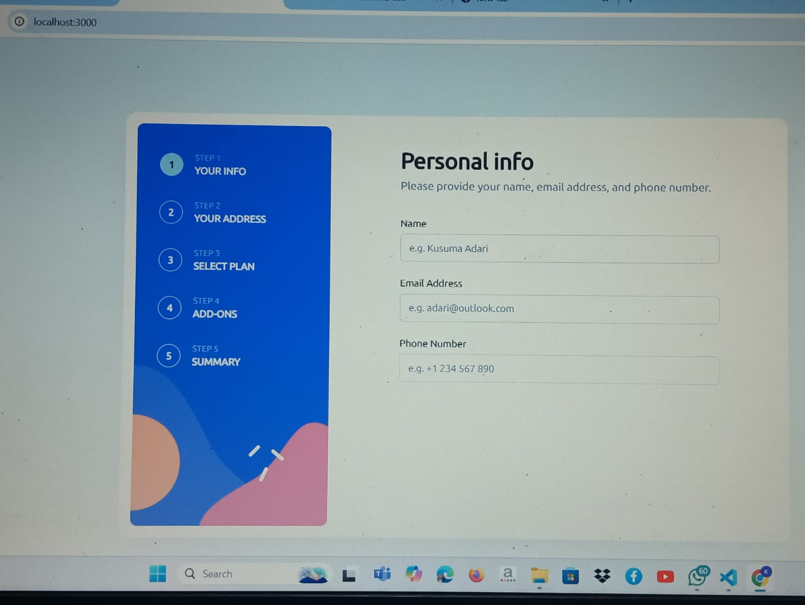
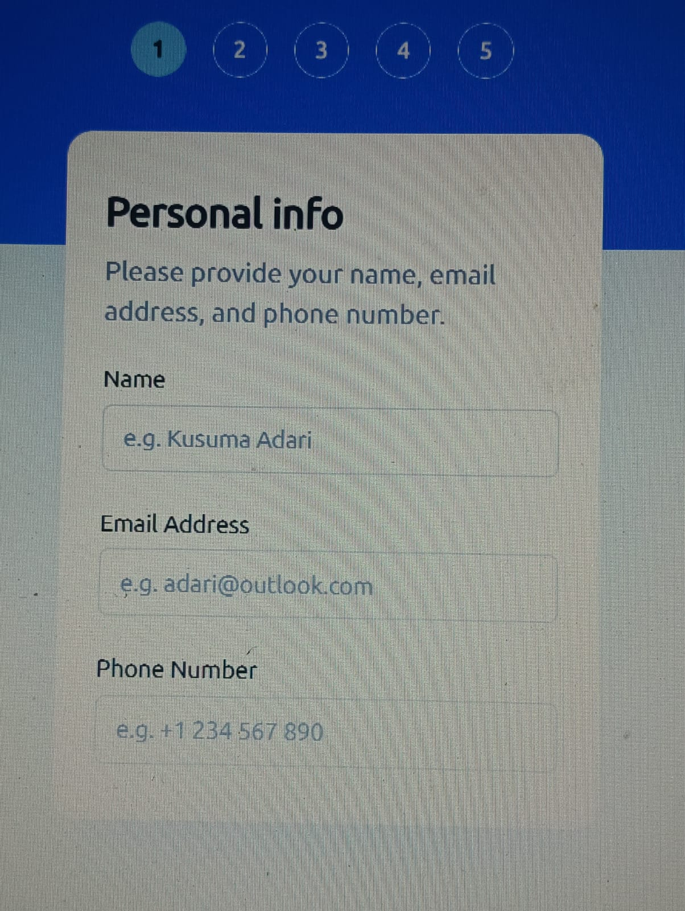

# Multi-step form solution

This is a solution to the Multi-step form challenge given by Zenstreet.ai

### The challenge

Users should be able to:

- Complete each step of the sequence
  -step1 = Personal Information
  -step2 = Address
  -step3 & 4 = Preferences
  -step 5 = Submit
- Go back to a previous step to update their selections
- See a summary of their selections on the final step and confirm their order
- View the optimal layout for the interface depending on their device's screen size
- See hover and focus states for all interactive elements on the page
  -to proceed next steps hover at left-most-bottom edge button
- Receive form validation messages if:
  - A field has been missed
  - The email address is not formatted correctly
  - A step is submitted, but no selection has been made

### Screenshot

### Built with

- ReactJS
- NextJS
- Zustand State Management Library
- React-hook-form
- Zod
- TailwindCSS
- Shadcn UI
- Typescript

### Run Code

-git clone repository multi-step-form
-npm install
-npm run dev
